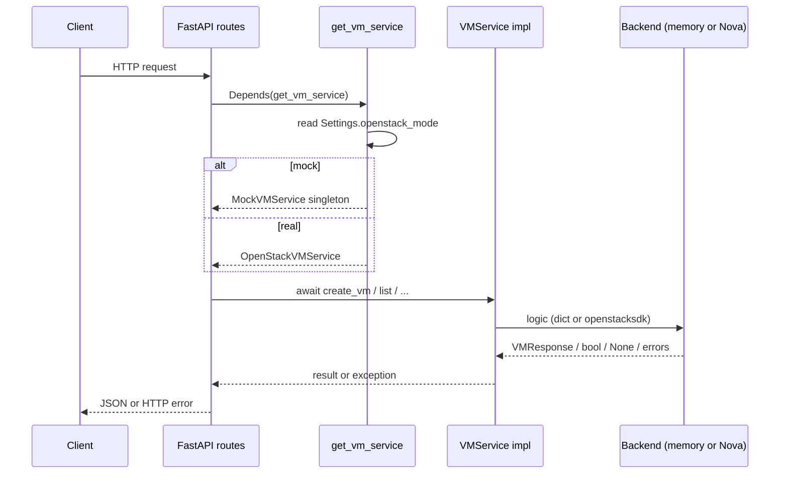
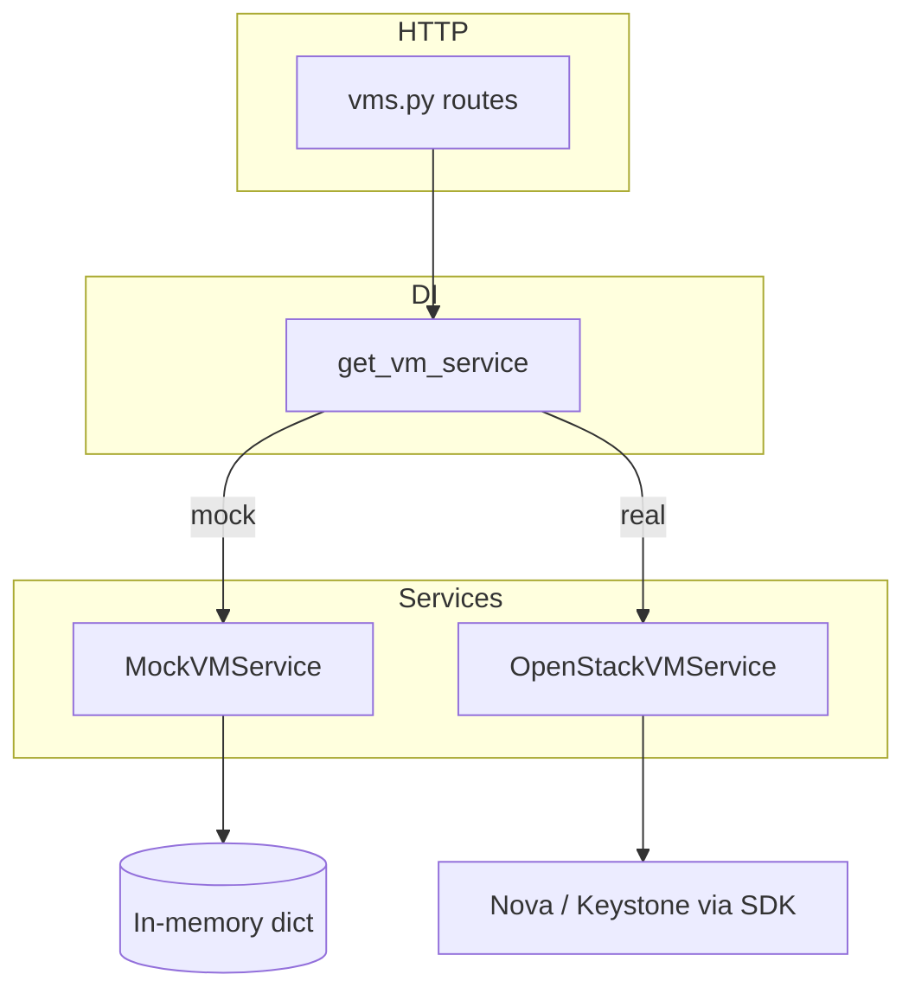

# OpenStack VM Lifecycle API

Proof-of-concept REST service that exposes **Nova VM lifecycle** operations behind a small, testable HTTP API. You can run it against an **in-memory mock** (no cloud) or a **real OpenStack** deployment via [openstacksdk](https://docs.openstack.org/openstacksdk/latest/).

---

## Table of contents

1. [What this application does](#what-this-application-does)
2. [Documentation (where to read what)](#documentation-where-to-read-what)
3. [Design choices (rationale and trade-offs)](#design-choices-rationale-and-trade-offs)
4. [How mode is selected (configuration)](#how-mode-is-selected-configuration)
5. [Request flow (end-to-end)](#request-flow-end-to-end)
6. [Mock mode — behavior and logic](#mock-mode--behavior-and-logic)
7. [Real mode — behavior and logic](#real-mode--behavior-and-logic)
8. [HTTP API and error mapping](#http-api-and-error-mapping)
9. [Quick start](#quick-start)
10. [Docker](#docker)
11. [Testing](#testing)
12. [OpenStack credentials for real mode](#openstack-credentials-for-real-mode)
13. [Architecture summary](#architecture-summary)
14. [SDLC](#sdlc)
15. [Roadmap / backlog](#roadmap--backlog)
16. [License](#license)

---

## What this application does

The API is versioned under **`/api/v1`**. It lets callers:

- **Create** a VM (name, image, flavor, optional network, keypair, metadata).
- **List** and **get** VMs with a normalized JSON shape (`id`, `name`, `status`, `image_id`, `flavor_id`, timestamps, `addresses`).
- **Delete** a VM.
- **Start**, **stop**, and **reboot** a VM (soft or hard reboot).

All VM operations go through a single Python interface, **`VMService`** (`app/services/base.py`). Two classes implement that interface:

| Implementation           | File                         | When used                          |
|---------------------------|------------------------------|------------------------------------|
| **`MockVMService`**       | `app/services/mock_vm.py`    | `OPENSTACK_MODE=mock` (default)    |
| **`OpenStackVMService`**  | `app/services/openstack_vm.py` | `OPENSTACK_MODE=real`            |

FastAPI routes in `app/api/routes/vms.py` only talk to `VMService`; they do not branch on mock vs real. That keeps the HTTP contract identical in both modes.

---

## Documentation (where to read what)

| Audience / goal | What to use |
|-----------------|-------------|
| **Human overview, modes, logic, design** | This **README** (single source for assessment-style documentation). |
| **Exact HTTP contract (schemas, try-it-out)** | **OpenAPI UI** at [`/docs`](http://127.0.0.1:8000/docs) (Swagger) and **ReDoc** at [`/redoc`](http://127.0.0.1:8000/redoc) while the server is running. |
| **Machine-readable spec** | **`GET /openapi.json`** (standard FastAPI) for codegen, mocks, or contract tests. |
| **Environment template** | **`.env.example`** — lists `OPENSTACK_MODE`, optional `OPENSTACK_PROJECT_ID`, and commented **`OS_*`** placeholders for real mode (copy to `.env`; `.env` is gitignored). |
| **CI behavior** | **`.github/workflows/ci.yml`** — documents the minimal quality gate (`pytest`). |
| **Container entrypoint and OS packages** | **`Dockerfile`**, **`docker-compose.yml`**. |
| **Code map** | `app/main.py` (app factory), `app/api/routes/` (HTTP), `app/services/` (mock + OpenStack), `app/models/schemas.py` (Pydantic types), `app/config.py`, `app/deps.py`, `tests/`. |

**Why OpenAPI is first-class:** Pydantic models on routes double as validation and documentation. Any field or status code change should be reflected automatically in `/docs`, reducing drift between “docs” and “code.”

---

## Design choices (rationale and trade-offs)

### API shape and versioning

- **Prefix `/api/v1`:** Leaves room for breaking or parallel evolution (`v2`) without collision with future root routes (metrics, admin).
- **Resource + sub-resource actions (`POST .../actions/start`):** Chosen over a generic `PATCH` with a `state` field because actions are **explicit**, easy to audit, and align with common cloud patterns (and Nova’s action-oriented model). **Trade-off:** more endpoints than a minimal CRUD surface.

### Backend abstraction (`VMService`)

- **Strategy pattern** (interface + mock + real): One HTTP layer, two behaviors. **Benefit:** identical integration tests and demos in mock mode; assessors can run the repo without a cloud. **Cost:** the mock must stay behaviorally close enough to real mode for tests to be meaningful (we document differences explicitly in this README).

### Configuration (`pydantic-settings`, `lru_cache`)

- **12-factor style env + optional `.env`:** Fits containers and Kubernetes without inventing a custom config format.
- **`get_settings` cached:** Avoids re-parsing env on every call; **implication:** changing env at runtime without restart does not refresh settings (acceptable for this PoC).

### Mock singleton vs new OpenStack service per request

- **Mock singleton:** Preserves VM state across requests in one process (expected for an in-memory “cloud”).
- **New `OpenStackVMService` per HTTP request:** Keeps dependency wiring simple and avoids holding SDK state across unrelated clients in a PoC. **Trade-off:** no connection pooling across requests; a production service would typically inject a **shared connection pool** or **per-tenant session** factory.

### Async + `asyncio.to_thread` for OpenStack

- **Problem:** `openstacksdk` is synchronous; calling it directly inside `async def` would block the event loop.
- **Choice:** `asyncio.to_thread` for each service method body. **Alternative:** run FastAPI in a sync stack (not ideal) or adopt an async-native client (not officially the path for openstacksdk). **Trade-off:** thread overhead and GIL interaction; acceptable for moderate concurrency in a PoC.

### Create VM: `wait_for_server` in real mode

- **Choice:** Block until Nova reports a terminal-ish state for the new server. **Benefit:** simple client semantics (`POST` returns the final or near-final VM). **Trade-off:** long HTTP requests, proxy timeouts, and poor UX at scale — listed in [Roadmap](#roadmap--backlog) (async jobs + `202`).

### Errors: `VMNotFoundError`, `404`, `502`

- **`VMNotFoundError`** for missing VMs on **actions** gives a clear domain signal without importing HTTP into the service layer.
- **Broad `502` mapping** on unexpected errors in routes keeps the PoC small; **trade-off:** clients cannot distinguish auth errors, quota, and network failures without parsing `detail` strings — production would use structured problem details and typed exceptions.

### Status normalization (`VMStatus`)

- **Why:** Nova exposes many string statuses; API consumers want a smaller enum. **Trade-off:** “shelved” and “shutoff” both map to `STOPPED`; clients that need fine granularity should call Nova directly or extend the mapper.

### Security (explicit non-goals for this PoC)

- **No authn/authz** on the API itself: acceptable for a closed lab or local demo; **not** acceptable on a public network. Roadmap calls out OAuth2/JWT or mTLS.

### Testing strategy

- **`pytest` + `TestClient` + dependency override:** Tests the real HTTP stack and route wiring without binding to a cloud. **`OPENSTACK_MODE=mock`** in tests plus an isolated `MockVMService` avoids the global singleton leaking state between tests.

---

## How mode is selected (configuration)

Settings are defined in **`app/config.py`** using **Pydantic Settings**:

- Values are read from **environment variables** and optionally a **`.env`** file in the project root (`env_file=".env"`).
- **`get_settings()`** is wrapped in **`@lru_cache`**, so the first read is reused for the lifetime of the process (typical for 12-factor apps).

Relevant fields:

| Setting                 | Type / default   | Role |
|-------------------------|------------------|------|
| **`OPENSTACK_MODE`**    | `mock` or `real` | Chooses which `VMService` implementation is injected. |
| **`OPENSTACK_PROJECT_ID`** | optional string | In **real** mode, passed into `openstack.connect(..., project_id=...)` to pin the SDK to one project. |
| **`DEBUG`**             | `false`          | Passed to FastAPI. |

**Dependency injection** (`app/deps.py`, function **`get_vm_service`**):

- If **`openstack_mode == "mock"`**: return a **module-level singleton** `MockVMService` (created once, reused for all requests in that process). That mimics “one shared cloud” for demos and keeps in-memory state stable across calls.
- If **`openstack_mode == "real"`**: return a **new** `OpenStackVMService(settings)` each time `get_vm_service` runs. FastAPI resolves a request’s dependencies **once per HTTP request**, so you get **one service instance per request**; that instance **lazily creates and caches** a single **`openstack.connection.Connection`** on `self._conn` for the rest of that request. There is **no cross-request connection pool** in the current code (each new request may open a new SDK connection when first needed).

Changing mode requires **restarting the process** (and clearing settings cache in tests if you toggle env vars between cases).

---

## Request flow (end-to-end)



---

## Mock mode — behavior and logic

**Purpose:** Run the full HTTP surface **without** Keystone, Nova, or any `OS_*` variables. Used for **local dev**, **Docker demos**, **CI**, and **`pytest`**.

### Storage and concurrency

- VMs live in a **`dict[str, VMResponse]`** keyed by UUID string.
- Every mutating or read path that touches the dict uses an **`asyncio.Lock`** (`async with self._lock`) so concurrent HTTP requests do not corrupt the dict or read half-updated objects.

### `create_vm`

1. Generate a new **`uuid4`** as `id`.
2. Build a **`VMResponse`** with **`status=BUILD`**, timestamps in UTC, `addresses={}`, and copy `name`, `image_id`, `flavor_id` from the request (image/flavor are **not** validated against a catalog).
3. Insert into the dict under the lock.
4. Schedule a **background asyncio task** (`asyncio.create_task`) that:
   - sleeps **~50 ms** (simulates asynchronous provisioning),
   - then, under the same lock, if the VM still exists, replaces it with a copy whose **`status` is `ACTIVE`**, updates **`updated_at`**, and sets a fake **`addresses`** map (`private` → one synthetic IPv4 derived from `hash(vm_id)`).
5. Return the **initial** `BUILD` response immediately to the client (so callers may see `BUILD` on first GET, then `ACTIVE` shortly after—similar to a real cloud).

### `list_vms`

Returns **`list(self._vms.values())`** under the lock (a snapshot copy of references; each value is a Pydantic model).

### `get_vm`

Returns **`self._vms.get(vm_id)`** or **`None`** if missing (routes turn `None` into **404**).

### `delete_vm`

If the id is missing → return **`False`** (routes → **404**). Else delete the entry and return **`True`** (**204**).

### `start_vm`

If missing → **`VMNotFoundError`** (routes → **404**). If already **`ACTIVE`** → **no-op** (idempotent start). Otherwise set status **`ACTIVE`** and refresh **`updated_at`**.

### `stop_vm`

If missing → **`VMNotFoundError`**. Else set status **`STOPPED`** and **`updated_at`**.

### `reboot_vm`

The **`hard`** flag is accepted for API parity but **not** used to change mock behavior. If missing → **`VMNotFoundError`**. Else set status **`ACTIVE`** and **`updated_at`** (treat reboot as “running again”).

### Important mock limitations

- State is **process memory only**; restart clears all VMs.
- No quotas, networks, or images are enforced.

---

## Real mode — behavior and logic

**Purpose:** Talk to a **real Nova** (and related services for create) using **openstacksdk**.

### Connection

- **`openstack.connect(cloud="envvars", ...)`** loads configuration from standard **`OS_*`** environment variables (and compatible **`clouds.yaml`** / vendor extensions as supported by the SDK).
- If **`OPENSTACK_PROJECT_ID`** is set in app settings, it is passed as **`project_id=`** so the connection is scoped to that project.
- The **`Connection`** object is **lazy-created** on first use and **cached** on `OpenStackVMService` (`_get_connection`).

### Async and threads

OpenStack SDK calls are **blocking**. Each public `async def` on `OpenStackVMService` runs the blocking work in a **worker thread** via **`asyncio.to_thread(...)`** so the FastAPI event loop stays responsive.

### `create_vm`

1. In the worker thread, build kwargs for **`conn.compute.create_server`**: `name`, `image_id`, `flavor_id`; optional `key_name`, `metadata`, and `networks=[{"uuid": network_id}]` if `network_id` was provided.
2. Call **`create_server`**, then **`wait_for_server`** so the HTTP request **does not return until Nova reaches a settled state** for that server (or Nova/SDK raises). This can take **minutes** on a slow cloud—unlike mock’s instant return.
3. Map the resulting server object to **`VMResponse`** via **`_server_to_vm`**.

### `list_vms`

Calls **`conn.compute.servers(details=True)`** and maps each server with **`_server_to_vm`**.

### `get_vm`

Calls **`conn.compute.get_server(vm_id)`**. On **any** exception, returns **`None`** (caller gets **404**). This is intentionally broad so transient SDK errors do not leak as 404 vs 502 in all cases; a production service might narrow this.

### `delete_vm`

1. **`get_server`**: if **`ResourceNotFound`** → return **`False`** (**404**). Other exceptions → **`False`** as well.
2. If server object falsy → **`False`**.
3. **`delete_server`**: on failure returns **`False`**. Success returns **`True`** (**204**).

### `start_vm` / `stop_vm` / `reboot_vm`

Each calls the corresponding Nova proxy method (`start_server`, `stop_server`, `reboot_server` with **`SOFT`** or **`HARD`** for reboot). If the SDK raises **`ResourceNotFound`**, the service raises **`VMNotFoundError`** so routes return **404**. Other SDK errors bubble to routes as **502**.

### Status and field mapping (`_server_to_vm` / `_map_os_status`)

Nova’s string **`status`** is mapped into the API enum **`VMStatus`**:

| Nova (examples)        | API `VMStatus` |
|------------------------|----------------|
| `ACTIVE`               | `ACTIVE`       |
| `BUILD`                | `BUILD`        |
| `ERROR`                | `ERROR`        |
| `DELETED`              | `DELETED`      |
| `SHUTOFF`, `STOPPED`, shelved variants | `STOPPED` |
| Anything else / empty  | `UNKNOWN`      |

**`image_id`** / **`flavor_id`** are taken from top-level attributes if present, else from nested **`image`** / **`flavor`** dict shapes the SDK may return. **`addresses`** follow Nova’s dict-of-lists structure, normalized to string IPs. Timestamps are parsed from strings or datetimes when possible.

### Real mode operational notes

- You must supply valid **image**, **flavor**, and (depending on cloud policy) **network** values; Nova will reject invalid combinations (**502** with message in body).
- **`wait_for_server`** on create means long-running requests and possible timeouts at reverse proxies—see [Roadmap](#roadmap--backlog) for async-job patterns.

---

## HTTP API and error mapping

Routes live in **`app/api/routes/vms.py`** (and **`health.py`** for liveness).

| HTTP | Path | Success | Error behavior |
|------|------|---------|----------------|
| `GET` | `/api/v1/health` | `200` `{"status":"ok"}` | — |
| `POST` | `/api/v1/vms` | `201` body: `VMResponse` | Any exception from service → **`502`** with `"OpenStack error: ..."` (including mock if something unexpected failed). |
| `GET` | `/api/v1/vms` | `200` `{ "vms": [...], "total": N }` | **`502`** on service errors. |
| `GET` | `/api/v1/vms/{id}` | `200` `VMResponse` | Missing VM → **`404`**; service errors → **`502`**. |
| `DELETE` | `/api/v1/vms/{id}` | `204` no body | Missing → **`404`**; **`502`** on errors. |
| `POST` | `/api/v1/vms/{id}/actions/start` | `200` `ActionResponse` | **`VMNotFoundError`** → **`404`**; other errors → **`502`**. |
| `POST` | ...`/actions/stop` | same | same |
| `POST` | ...`/actions/reboot?hard=false` | same | `hard=true` selects **HARD** reboot in **real** mode; mock accepts the query but does not simulate a difference. |

**Request body for `POST /vms`:**

| Field | Required | Notes |
|-------|----------|--------|
| `name` | yes | VM name |
| `image_id` | yes | Image UUID or name (Nova must resolve in real mode) |
| `flavor_id` | yes | Flavor UUID or name |
| `network_id` | no | Neutron network UUID for primary NIC |
| `key_name` | no | Nova keypair name |
| `metadata` | no | String key/value dict |

Interactive docs: **`/docs`** (Swagger) and **`/redoc`** when the server is running.

---

## Quick start

```bash
python3 -m venv .venv
source .venv/bin/activate   # Windows: .venv\Scripts\activate
pip install -r requirements.txt
cp .env.example .env        # optional; defaults work for mock mode
uvicorn main:app --reload --host 0.0.0.0 --port 8000
```

```bash
curl -s http://127.0.0.1:8000/api/v1/health
curl -s -X POST http://127.0.0.1:8000/api/v1/vms \
  -H "Content-Type: application/json" \
  -d '{"name":"demo","image_id":"cirros","flavor_id":"m1.small"}' | jq .
```

For **real** mode, set `OPENSTACK_MODE=real` and configure **`OS_*`** (see [OpenStack credentials](#openstack-credentials-for-real-mode)).

---

## Docker

```bash
docker compose up --build
```

Compose sets **`OPENSTACK_MODE=mock`** by default. The API is at **http://localhost:8000**. The stack includes a **healthcheck** against `/api/v1/health`.

To run **real** mode in Compose, set `OPENSTACK_MODE=real` and supply credentials via **`env_file`** (gitignored) or `environment:`—never commit secrets.

---

## Testing

**Automated (`pytest`):** from the repo root, with dependencies installed:

```bash
pytest -q
```

Tests use FastAPI’s **`TestClient`**, override **`get_vm_service`** with an isolated **`MockVMService`**, and set **`OPENSTACK_MODE=mock`** (see `tests/conftest.py`).

**Manual:** use **`/docs`** or **`curl`** against a running server (local or Docker), as in [Quick start](#quick-start).

---

## OpenStack credentials for real mode

This repository does **not** ship credentials. For **`OPENSTACK_MODE=real`**, obtain standard **`OS_*`** variables (or equivalent) from your **cloud operator**, **Horizon “API Access” / RC file**, or your organization’s secrets store. Typical variables include `OS_AUTH_URL`, `OS_USERNAME`, `OS_PASSWORD` (or application credential), `OS_PROJECT_NAME` or `OS_PROJECT_ID`, `OS_USER_DOMAIN_NAME`, `OS_PROJECT_DOMAIN_NAME`, `OS_IDENTITY_API_VERSION=3`, and `OS_INTERFACE`. See **`.env.example`** for a commented template.

---

## Architecture summary



The diagram matches the sections above: **routes → DI → implementation → backend**. For a deeper rationale for each box, see [Design choices](#design-choices-rationale-and-trade-offs).

---

## SDLC

- **Branches:** short-lived feature branches or trunk-based flow from `main`.
- **CI:** GitHub Actions runs `pytest` (`.github/workflows/ci.yml`).
- **Secrets:** use `.env` locally (gitignored) or your platform’s secret manager; never commit `OS_PASSWORD`.
- **Containers:** same `Dockerfile` image; change env per environment (`mock` vs `real`).

---

## Roadmap / backlog

1. Authentication & authorization (OAuth2/JWT, tenant → project mapping).
2. Async job model (`202` + job polling) for long-running create/delete.
3. Richer lifecycle (shelve, resize, volumes, console URL).
4. Idempotency keys on create.
5. Structured logging, metrics, tracing.
6. Rate limiting, quotas, circuit breakers.
7. Policy engine (OPA / OpenStack policy).
8. Multi-region / multi-cloud routing.

---

## License

MIT — see [LICENSE](LICENSE).
